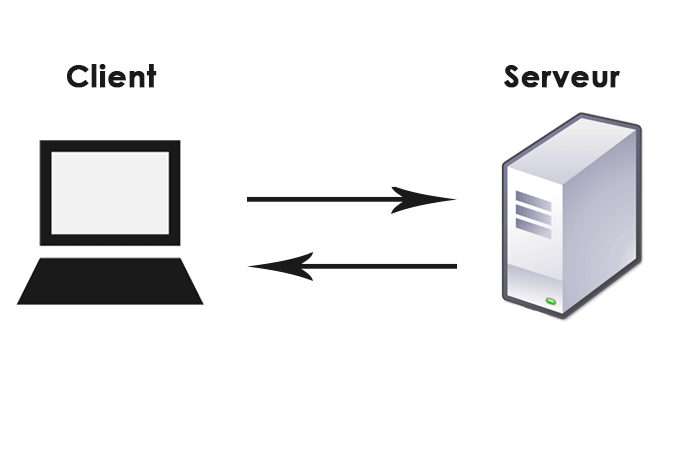

% Programmation avec Python (chapitre 7)
% Dimitri Merejkowsky

\center \huge Rappels sur les classes

# Définition d'une classe

Construire une classe`Counter` vide:

```python
class MyClass:
   ...
```


# Instantiation

Construire une nouvelle *instance* de `Counter`

```python
>>> my_instance = MyClass()
```

# Méthodes

Ajouter une méthode:

```python
class MyClass:
    def my_method(self):
        ...
```

`self` représente l'objet courant.

# Méthodes
     
Appeler une méthode:

```python
>>> my_instance = MyClass()
>>> my_instance.my_method()
```

# Ajouter un attribut

```python
>>> my_instance = MyClass()
>>> my_instance.my_attribute = 0
```

# Accéder à un attribut dans la classe

```python
class MyClass():
    def my_method(self):
    	print(self.my_attribute)
```

# Méthode spéciale: __init__

Initialiser les attributs:

```python
class MyClass:
    def __init__(self):
        self.my_attribute = 0

>>> my_instance = MyClass()
>>> my_instance.my_attribute
0
```


#

\center \huge Compléments sur les classes

# Attributs d'instances

En vrai les attributs qu'on a vu maintenant sont des
attributs d'instance. Ils sont liés à l'instance courante.

Mais on dit souvent "attribut" tout court.

Il existe un autre type d'attribut.

# Attributs de classe

Dans le bloc de la classe, mais à l'extérieur des
blocs de méthodes:

```python
class Car:
    total_number_of_cars = 0

    def __init__(self, color="black"):
    	# attribut d'instance: avec self
    	self.color = color
    	# attribut de classe: avec le nom de la classe
    	Car.total_number_of_cars += 1
```

# Attributs de classe - 2

Les attributs de classe sont partagés entre toutes
les instances:

```python
>>> ford = Car()
>>> ferrari = Car(color="red")
>>> Car.total_number_of_cars
2
```

# Méthodes de classes

De même, techniquement les méthodes qu'on a vu sont des méthodes
d'instance, et il existe des méthodes de classe


# Méthodes de classes


Avec un joli `@classmethod` au-dessus

```python
class Car:
    total_number_of_cars = 0

    @classmethod
    def print_number_of_cars(cls):
    	print(cls.total_number_of_cars, "have been made")
```

Notez le `cls`.

# Méthodes de classes

Pour appeler:

```python
>>> ferrari = Car(color="red")
>>> ford = Car()
>>> Car.print_number_of_cars()
2 cars have been made
```

# Note

Au lieu de dire "de classe" on utilise parfois "statique". 

Mais "statique" veut dire plein d'autres chose...


# On retrouve le même mécanisme

* ce qu'on écrit

```
car.print_color()
```

\vfill

* ce qui est appelé:

```
# self = car
def print_color(self):
      print(self.color)

```

# On retrouve le même mécanisme


* ce qu'on écrit

```
Car.print_number_of_cars()
```

\vfill

* ce qui est appelé:

```
# cls = Car
@classmethod
def print_number_of_cars(cls):
     print(cls.total_number_of_cars)
```

#

\center \huge Les API Web


# HTTP

Un *protocole*: une façon pour des machines différentes d'échanger des informations.

On fait souvent un aller-retour du *client* vers le *serveur*.



# Requêtes

Une requête part du client vers le serveur et consite en:

* Une URL
* Un verbe (souvent GET)
* Des paramètres (sous la forme: `?a=42&b=true`)
* Et d'autres trucs

# Réponses

Une réponse revient du serveur vers le client et contient

* Un code de retour
* Du contenu (très souvent, du texte)
* Et d'autres trucs

# API Web et navigateurs

Quand vous tapez une url dans votre navigateur ou que vous suivez
un lien, c'est votre navigateur qui fait la requête.

Le serveur lui renvoie un contenu particulier (du HTML)
C'est ce que vous voyez quand vous faites "show source"

Vous voyez parfois le code de retour (le plus connu étant 404)

*C'est très simplifié*

#  Le format HTML

Des règles pour interpréter du texte:

```html
<body>
<h1>Ceci est un titre</h1>
<p>
Ceci est un paragraphe
</p>
</body>
```

# Faire des requêtes en Python

Avec `requests`, *la* librarie pour faire des requêtes HTTP en Python.

Malheureusement pas dans la librarie standard.

```python
import requests

>>> response = request.get(url)
>>> response.status_code
200 # si tout va bien
>>> response.text
"<!DOCTYPE html ..."> # le texte de la réponse
```


# Une API Web

Faire tourner de code sur le client, en utilisant du code sur un
serveur *via* le protocole HTTP.


# Utiliser une API Web

* Lire les conditions d'utilisation (important!)
* Regarder les URLs possibles et les paramètres attendus
* Ensuite seulement, écrire du code.

Notez qu'on a *absolument* aucune connaissance du code qui tourne sur le serveur!


# JSON

* Un format *texte*. (Comme HTML)
*  *Très* utilisé justement pour échanger des données entre des machines différentes.
* Implémenté dans plein de langages.


# JSON

Examples:

* Une liste:

```json
["one", "two"]
```

* Un "objet":
```json
{
   "color": "blue",
   "size": 3
   "pretty": bool,
}
```

**Attention**: les clés json sont *toujours* des strings.

# JSON

On peut imbriquer les objets les uns dans les autres:

```json
{
   "a": 42,
   "b": true,
   "c": ["one", "two"],
}
```


# JSON / Python

Python | JSON
-------|-----
dictionnary | object
True        | true
False       | false
None        | null


# Parser du JSON en Python


```python
>>> import json
>>> data = json.loads("...")
>>> data["a"]
42
```

# Émettre du JSON à partir d'un objet Python

```python
>>> import json
>>> my_object = { "key1" : ["one", "two"] }
>>> json.dumps(my_object, indent=2)
"""
{
  "key1": ["one", "two"]
}
"""
```


#

\center \huge Atelier


# Objectif

* Partir d'un bout de code (moche) qui utilise l'API marvel
* Le nettoyer en introduisant des classes
* Le rendre plus flexible
* Etc ...

# Requests + JSON

```python
>>> response = requests.get(url)
>>> text = response.text
>>> data = json.loads(text)
```

Ou directement

```python
>>> response = requests.get(url)
>>> data = response.json()
```
