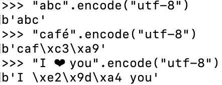

% Programmation avec Python (chapitre 14)
% Dimitri Merejkowsky

\center \huge Parlons de binaire

# Bits et octets

* Un bit (*bit* en anglais) c'est la valeur 1 ou 0
* Un octet (*byte* en anglais) c'est une suite de 8 bits

# À retenir

**Ces paquets de 8 ne veulent rien dire en eux-mêmes**.
Ils n'ont de sens que dans le cadre d'une *convention*.

Détaillons.


# Bases

On peut *interpréter* bits et octets comme des nombres

```
 2: 01         5 101  1*4 + 0*2 + 1*1
10: 0..9     305 305  3*10 + 0*10 + 5*1
16: 0..9..F 3490 DA2  (d=13)*256 + (a=10)*16 + 2*1
```

# Bases en Python

```python
>>> 0b101
5
>>> 0xda2
3490
```

```python
>>> bin(5)
"0b101"
>>> hex(3490)
"0xda2"
```

# Manipuler des octets en Python

Avec `bytearray` par exemple:

```python
data = bytearray(
  [0b1100001,
   0b1100010,
   0b1100011,
   0b1100100]
)
# equivalent:
data = bytearray([97,98,99])
# equivalent aussi:
data = bytearray([0x61, 0x62, 0x63]
```


# Texte

On peut interpréter des octets comme du texte - c'est la table ASCII


# ASCII - remarques

* C'est *vieux* - 1960
* Le A est pour American
* Ça sert à *envoyer* du texte sur des terminaux d'où les "caractères" non-imprimables dans la liste
* Mais c'est une convention *très* utilisée

# En ASCII

C'est aussi la façon dont l'affiche python

```python
>>> data = bytearray([97,98,99])
>>> data
bytearray(b"abc")
```

# Types

La variable `b"abc"` est une "chaîne de bits", de même que `"abc"` est une "chaîne de caractères".

Python apelle ces types `bytes` et `str`:

```python
>>> type("abc")
str
>>> type(b"abc")
bytes
```
Notez bien que ce qu'affiche Python n'est qu'une *interpétation* du tableau de bits.

# bits versus bytearray

De la même manière qu'on ne peut pas un caractère dans une string, on ne peut
pas modifier un bit - ou un octet dans un `bytes`.

```python
>>> a = "foo"
>>> a[0] = "f"
TypeError: 'str' object does not support item assignment
>>> b = b"foo"
>>> b[0] = 1
TypeError: 'bytes' object does not support item assignment
```

# bits versus bytearray (2)

Par contre on peut modifier un bytearray

```python
>>> b = bytearray(b"foo")
>>> b[0] = 95
>>> b
bytearray("_oo")
```


# Quand ce n'est pas imprimable

Python affiche `\x` et le code hexa:

```python
>>> data = bytearray([7, 69,  76, 70])
>>> data
bytearray(b'\x07ELF')
```

# Plus loin que l'ASCII

Pas de caractères accentuès dans ASCII. Du coup, on a d'autres *conventions* qu'on appelle "encodage".

```python
# latin-1: utilisé sur certains vieux sites
# - souvent européens
>>> bytearray([0b11101001]).decode('latin-1')
'é'
```

```python
# cp850: dans l'invite de commande Windows
>>> bytearray([0b11101001]).decode('cp850')
'Ú'
```

Mais ça, c'était avant. Avant UTF-8, un encodage qui a mis tout le monde d'accord.

# UTF-8 en pratique

* Compatible avec ASCII
* Mais certains caractères sont représentés par 2 octets ou plus:



# Conséquences

* Peut représenter *tout* type de texte (latin, chinois, coréen, langues disparues, ....)
* On ne peut pas accéder à la n-ème lettre directement dans une chaîne unicode, il faut parcourir lettre par lettre
* Et toutes les séquences de bits ne sont pas forcément valides

# Conclusions

* On utilise souvent le binaire pour échanger entre Python et le monde extérieur
* Python vous cache un peu ça en utilisant UTF-8 par défaut donc ça marche souvent
* Le 'plain text' n'existe pas: tout texte a un *encodage*, et il vous faut connaître cet encodage
* Si vous avez le choix, utilisez UTF-8
